

 

 

<a href="https://github.com/CupoMeridio/Java-Music-Playlist-Manager">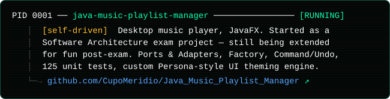</a>
<a href="https://github.com/CupoMeridio/waste-type-classifier">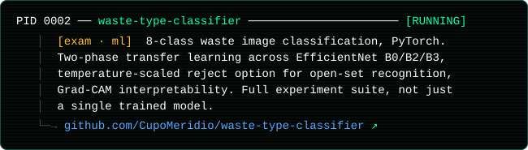</a>
<a href="https://github.com/CupoMeridio/Granpremio-MIVIA-2025">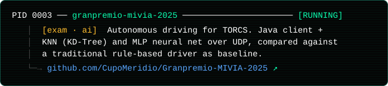</a>
<a href="https://github.com/CupoMeridio/UniSafe-Vote">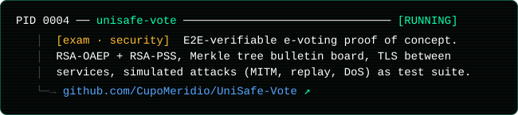</a>
<a href="https://github.com/CupoMeridio/Launchpad-Online">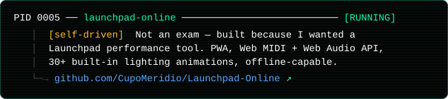</a>
<a href="https://github.com/CupoMeridio/advanced_tc">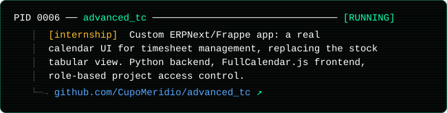</a>
<a href="https://github.com/CupoMeridio/stm32-hal-modular-drivers">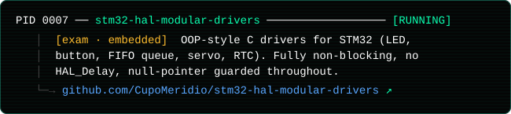</a>
<a href="https://github.com/CupoMeridio/rubrica-java-mvc">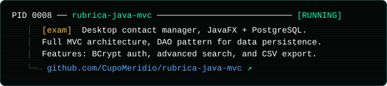</a>
<a href="https://github.com/CupoMeridio/Wordageddon-G17">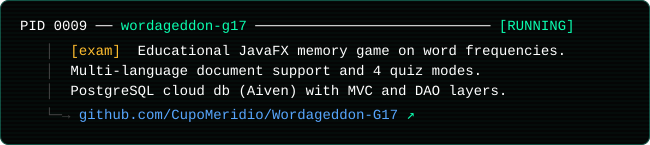</a>
<a href="https://github.com/CupoMeridio/beyond-reality-journeys">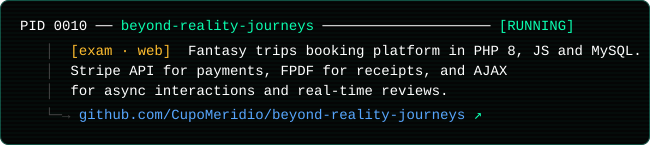</a>
<a href="https://github.com/CupoMeridio/vinyl_collection_app_gruppo_16">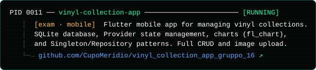</a>

 

 

